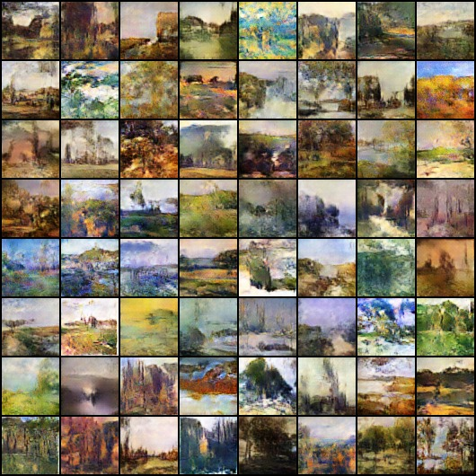
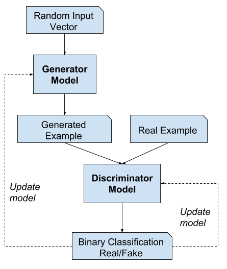

# UniquePainting

Welcome to UniquePainting – where art meets artificial intelligence to redefine portrait drawing.

## Overview

This repository showcases the culmination of cutting-edge technology and artistic creativity, employing Generative Adversarial Networks (GANs) to generate mesmerizing portrait drawings that transcend imagination. All images presented in this repository are exclusively AI-generated, showcasing the limitless possibilities when technology and artistry converge.

## Dataset

For training, we used the Impressionist Landscape Paintings dataset available on Kaggle. Access the dataset [here](https://www.kaggle.com/datasets/robgonsalves/impressionistlandscapespaintings). It includes 5000 paintings in 1024x1024 RGB format, maintaining an original aspect ratio of 1.27:1.

## Preview

*Output of the AI-generated portrait drawings.*

## Training Process

Explore the training process through a dynamic video capturing the evolution of the GAN model:

[Training Process Video](gans_training.avi)

## GAN Architecture

Gain insights into the underlying architecture driving the artistic magic:

*Caption: Visualization of the GAN architecture responsible for crafting the mesmerizing portrait drawings.*

## How it Works

UniquePainting utilizes a Generative Adversarial Network (GAN) to generate lifelike portrait drawings. The GAN consists of a generator network that creates realistic portraits and a discriminator network that evaluates the authenticity of the generated images. Through a process of adversarial training, the generator refines its ability to produce convincing portraits, while the discriminator becomes adept at distinguishing between AI-generated and real images. This dynamic interplay creates striking, never-before-seen portraits that blend the finesse of technology with the beauty of art.
